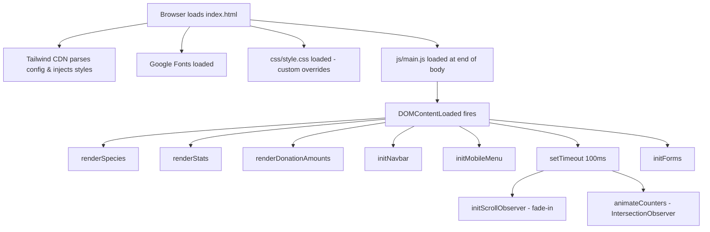

# Design Document

## Feature: Endangered Species Landing Page (JagaAlam)

---

## Overview

JagaAlam is a single-page, static website built with HTML5, Tailwind CSS (via CDN), and Vanilla JavaScript. Its purpose is to raise awareness about endangered species in Indonesia, showcase the organization's conservation impact, and drive visitors toward donation and contact actions.

The page is structured as a linear narrative scroll: Hero → About → Species → Impact → Donate → Contact → Footer. All dynamic content (species cards, stat counters, donation buttons) is rendered by a single JavaScript module (`js/main.js`) on `DOMContentLoaded`. There is no backend, no build step, and no external framework beyond Tailwind CDN.

Key design goals:
- Visually compelling, nature-themed aesthetic using a custom Tailwind color palette (forest, leaf, moss, sand, amber)
- Fully responsive across mobile and desktop breakpoints (768px threshold)
- Accessible: semantic HTML, descriptive `alt` attributes, keyboard-navigable forms
- Progressive enhancement: the page degrades gracefully if JavaScript is unavailable for non-critical content

---

## Architecture

The application is a classic multi-section single-page website with no routing, no state management library, and no build pipeline.



**Rendering model:** All dynamic HTML is generated via template literal strings and injected with `innerHTML`. No virtual DOM or diffing is used — content is rendered once on load and never re-rendered.

**Event model:** All interactivity is handled through native DOM event listeners attached during initialization functions. No event delegation framework is used.

**Scroll detection:** Two `IntersectionObserver` instances are used:
1. Fade-in observer — triggers `.visible` class on `.fade-in` elements as they enter the viewport
2. Counter observer — triggers animated counting on `.stat-number` elements when the Impact section scrolls into view

---

## Components and Interfaces

### 1. Navbar (`#navbar`)

- Fixed, full-width, `z-50`
- Transparent at scroll position 0; transitions to solid `#1a3c2e` background with drop shadow when `window.scrollY > 60` (CSS class `.scrolled` toggled by JS)
- Desktop (≥768px): logo + nav links + "Donate Now" CTA button
- Mobile (<768px): logo + hamburger icon; nav links hidden

**JS interface:**
```js
initNavbar() // attaches scroll listener, toggles .scrolled on #navbar
```

### 2. Mobile Menu (`#mobile-menu`)

- Full-screen overlay (`position: fixed`, `z-40`, `bg-forest`)
- Hidden by default (`class="hidden"`)
- Opened by hamburger button (`#menu-btn`), closed by close button (`#close-menu`) or any `.mobile-link` click

**JS interface:**
```js
initMobileMenu() // attaches open/close event listeners
```

### 3. Hero Section (`#hero`)

- `height: 100vh`, centered content
- Background: Unsplash image + CSS gradient overlay
- Two CTA buttons: anchor links to `#species` and `#donate`
- Animated bounce arrow (CSS `animate-bounce`)
- Static HTML — no JS rendering

### 4. About Section (`#about`)

- Two-column grid on desktop, single column on mobile (Tailwind `md:grid-cols-2`)
- Static HTML — no JS rendering
- Contains a floating stat callout div overlaid on the image

### 5. Species Cards (`#species-grid`)

- Grid: `md:grid-cols-3` on desktop, single column on mobile
- Cards injected by `renderSpecies()` from the `species` data array
- Each card: image, conservation status badge, species name, population count, description
- Cards have `.fade-in` class for scroll-triggered animation
- Card hover: `translateY(-6px)` + box-shadow (CSS)

**JS interface:**
```js
renderSpecies() // reads species[], generates HTML, sets #species-grid.innerHTML
```

**Species data shape:**
```js
{
  name: string,
  status: string,           // e.g. "Critically Endangered"
  statusColor: string,      // Tailwind classes e.g. "bg-red-100 text-red-700"
  population: string,       // e.g. "~13,000 remaining"
  description: string,
  image: string             // URL
}
```

### 6. Impact / Stats Section (`#stats-grid`)

- Four stat counters injected by `renderStats()` from the `stats` data array
- Each counter: animated number + suffix + label
- Animation triggered by `IntersectionObserver` (threshold 0.5), runs once per load

**JS interface:**
```js
renderStats()       // injects stat HTML into #stats-grid
animateCounters()   // attaches IntersectionObserver to .stat-number elements
```

**Stats data shape:**
```js
{
  value: number,    // target count
  suffix: string,   // e.g. "+", "M+"
  label: string
}
```

### 7. Donation Section (`#donate`)

- Preset amount buttons injected by `renderDonationAmounts()` from `donationAmounts` array
- Clicking a button: sets `.active` class on clicked button, removes from others, populates `#custom-amount` input
- Donation form (`#donate-form`): name (required), email (required), custom amount (optional)
- On valid submit: shows `#form-msg`, resets form, hides message after 4 seconds

**JS interface:**
```js
renderDonationAmounts() // injects buttons, attaches click listeners
initForms()             // attaches submit handlers for #donate-form and #contact-form
```

**Donation amounts data shape:**
```js
{
  label: string,   // e.g. "IDR 50K"
  value: number    // e.g. 50000
}
```

### 8. Contact Section (`#contact`)

- Two-column layout on desktop, single column on mobile
- Static contact info (address, email, phone)
- Contact form (`#contact-form`): name (required), email (required), message textarea (required)
- On valid submit: shows `#contact-msg`, resets form, hides message after 4 seconds

### 9. Footer

- Static HTML
- Logo wordmark, tagline, social media links (Instagram, Twitter, Facebook, YouTube), copyright

### 10. Scroll Fade-In Observer

- Observes all `.fade-in` elements (species cards, stat blocks)
- Adds `.visible` class when element intersects viewport at threshold 0.15
- Unobserves after first trigger (one-shot animation)

**JS interface:**
```js
initScrollObserver() // attaches IntersectionObserver to all .fade-in elements
```

---

## Data Models

All data is defined as JavaScript arrays of plain objects in `js/main.js`. There is no external data source, API, or persistence layer.

### Species Array

```js
const species = [
  {
    name: string,         // Common name of the species
    status: string,       // IUCN conservation status label
    statusColor: string,  // Tailwind utility classes for badge styling
    population: string,   // Human-readable population estimate
    description: string,  // 1-2 sentence description of threats
    image: string         // Absolute URL to species photo
  },
  // ... minimum 3 entries (currently 6)
]
```

### Stats Array

```js
const stats = [
  {
    value: number,   // Numeric target for counter animation
    suffix: string,  // Appended after number (e.g. "+", "M+", "")
    label: string    // Descriptive label below the number
  },
  // ... minimum 4 entries
]
```

### Donation Amounts Array

```js
const donationAmounts = [
  {
    label: string,  // Display label (e.g. "IDR 50K")
    value: number   // Numeric value populated into the form input
  },
  // ... minimum 4 entries
]
```

### DOM State (implicit)

There is no explicit application state object. UI state is encoded directly in the DOM:
- Navbar scroll state: presence of `.scrolled` class on `#navbar`
- Mobile menu visibility: presence of `hidden` class on `#mobile-menu`
- Active donation button: presence of `.active` class on `.amount-btn` elements
- Fade-in state: presence of `.visible` class on `.fade-in` elements
- Counter animation: `IntersectionObserver` unobserves after first trigger (one-shot)

---

## Correctness Properties

*A property is a characteristic or behavior that should hold true across all valid executions of a system — essentially, a formal statement about what the system should do. Properties serve as the bridge between human-readable specifications and machine-verifiable correctness guarantees.*


### Property 1: Species card rendering completeness

*For any* array of species objects of length N (N ≥ 1), calling `renderSpecies()` should inject exactly N `.species-card` elements into `#species-grid`, and each rendered card should contain the species name, conservation status badge (with the correct `statusColor` classes), population string, and description from the corresponding data object.

**Validates: Requirements 5.1, 5.2, 5.3**

### Property 2: Stats rendering count

*For any* stats array of length N (N ≥ 1), calling `renderStats()` should inject exactly N `.stat-number` elements into `#stats-grid`, each with the correct `data-target` and `data-suffix` attributes matching the source data.

**Validates: Requirements 6.1**

### Property 3: Counter animation reaches target value

*For any* `.stat-number` element with a given `data-target` value T and `data-suffix` S, after the `IntersectionObserver` callback fires, the element's `textContent` should eventually equal `T.toLocaleString() + S`.

**Validates: Requirements 6.2**

### Property 4: Counter animation runs only once

*For any* `.stat-number` element, after the counter animation completes, `observer.unobserve()` should have been called on that element, ensuring that re-scrolling past the Impact section does not restart the animation.

**Validates: Requirements 6.5**

### Property 5: Donation buttons rendering count

*For any* `donationAmounts` array of length N (N ≥ 1), calling `renderDonationAmounts()` should inject exactly N `.amount-btn` elements into `#donation-amounts`, each with a `data-value` attribute matching the corresponding entry's `value` field.

**Validates: Requirements 7.1**

### Property 6: Donation button click populates amount input

*For any* `.amount-btn` element with `data-value` V, clicking that button should set the value of `#custom-amount` to V (as a string).

**Validates: Requirements 7.2**

### Property 7: Donation button active state mutual exclusion

*For any* two distinct `.amount-btn` elements A and B, clicking A then B should result in only B having the `.active` class, and A should not have `.active`. At most one button may hold `.active` at any time.

**Validates: Requirements 7.3**

### Property 8: All rendered images have non-empty alt attributes

*For any* `` element present in the page after `DOMContentLoaded` (including those injected by `renderSpecies()`), the `alt` attribute should be present and non-empty.

**Validates: Requirements 10.5**

---

## Error Handling

Since this is a static front-end page with no backend or network requests, error handling is limited to:

### Missing DOM Elements
- All JS initialization functions (`initNavbar`, `initMobileMenu`, `initForms`, etc.) assume their target elements exist. If an element is missing (e.g., `#species-grid`), `innerHTML` assignment will throw a `TypeError`. Mitigation: the HTML structure is static and co-deployed with the JS — element presence is guaranteed.

### IntersectionObserver Not Supported
- Requirement 6.4 specifies a fallback: if `IntersectionObserver` is unavailable, stat counters should display their final target values immediately without animation.
- Implementation: check `typeof IntersectionObserver !== 'undefined'` before using it; if absent, directly set `textContent` to the target value.

### Form Validation
- Both forms use native HTML5 validation (`required` attributes, `type="email"`). The browser prevents submission and displays native validation messages when required fields are empty or invalid.
- No custom validation logic is needed beyond what the browser provides.

### Image Loading Failures
- Species card images are loaded from Unsplash URLs. If an image fails to load, the browser displays the `alt` text. No JS error handling is needed.

### Counter Animation Edge Cases
- If `data-target` is `0`, the counter starts and ends at `0` — no infinite loop risk.
- If `Math.ceil(target / 60)` produces `0` (only possible if target is 0), the `step` defaults to `0` and the interval would never clear. The implementation should guard: `const step = Math.max(1, Math.ceil(target / 60))`.

---

## Testing Strategy

This feature is a static HTML/CSS/JS landing page. The appropriate testing approach is:

### Unit Tests (Example-Based)

Use a DOM testing environment (e.g., jsdom with Jest, or Vitest + jsdom) to test JS module behavior:

- **Navbar scroll behavior**: Simulate `scroll` events, verify `.scrolled` class toggling at the 60px threshold
- **Mobile menu open/close**: Simulate clicks on `#menu-btn` and `#close-menu`, verify `hidden` class toggling
- **Form submission (valid)**: Fill required fields, submit, verify success message appears and form resets
- **Form submission (invalid)**: Submit empty form, verify `checkValidity()` returns false
- **IntersectionObserver fallback**: Mock `IntersectionObserver` as undefined, verify stat numbers show target values immediately

### Property-Based Tests

Use a property-based testing library (e.g., [fast-check](https://github.com/dubzzz/fast-check) for JavaScript) with minimum 100 iterations per property.

Each property test references its design document property via a comment tag:
`// Feature: endangered-species-landing-page, Property N: <property_text>`

**Property 1 — Species card rendering completeness**
Generate arbitrary arrays of species objects (varying length, names, statuses, colors). Call `renderSpecies()` with each array and assert:
- DOM contains exactly N `.species-card` elements
- Each card's innerHTML contains the species name, status, statusColor classes, population, and description

**Property 2 — Stats rendering count**
Generate arbitrary stats arrays (varying length, values, suffixes). Call `renderStats()` and assert:
- DOM contains exactly N `.stat-number` elements with correct `data-target` and `data-suffix`

**Property 3 — Counter animation reaches target value**
Generate arbitrary stat objects with varying `value` (0–1,000,000) and `suffix` strings. Trigger the observer callback and run timers to completion. Assert final `textContent` equals expected formatted string.

**Property 4 — Counter animation runs only once**
Generate arbitrary stat data. Trigger the observer callback twice. Assert `unobserve` was called after the first trigger and the counter value does not reset.

**Property 5 — Donation buttons rendering count**
Generate arbitrary `donationAmounts` arrays. Call `renderDonationAmounts()` and assert N buttons with correct `data-value` attributes.

**Property 6 — Donation button click populates amount input**
Generate arbitrary donation amount objects. Render buttons, simulate click on each, assert `#custom-amount.value` equals the button's `data-value`.

**Property 7 — Donation button active state mutual exclusion**
Generate arbitrary pairs of button indices. Click first, then second. Assert only the second has `.active`; assert no other button has `.active`.

**Property 8 — All rendered images have non-empty alt attributes**
Generate arbitrary species arrays. Call `renderSpecies()`. Query all `img` elements in `#species-grid`. Assert every `img.alt` is a non-empty string.

### Structural / Smoke Tests

Verify static HTML structure using DOM queries (can be done with jsdom or a simple HTML parser):
- Required section IDs exist in correct order
- Navbar has correct CSS classes for fixed positioning
- Tailwind CDN script tag present
- `<meta name="viewport">` present
- `js/main.js` script tag before `</body>`
- Footer contains ≥4 social media links
- Responsive Tailwind classes present on grid containers (`md:grid-cols-2`, `md:grid-cols-3`)

### Manual / Cross-Browser Testing

- Verify layout on Chrome, Firefox, Safari, Edge (latest stable)
- Verify responsive breakpoints at 767px and 768px viewport widths
- Verify smooth scroll behavior on anchor link clicks
- Verify hero background image and gradient overlay render correctly
- Verify species card hover animations
- Verify fade-in scroll animations trigger correctly
